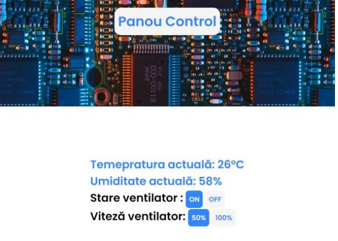

# REMOTE CONTROLLED ARDUINO

> Welcome to my high school computer science certificate project !

### Table of Contents

- [Introduction](#introduction)
- [Description](#description)
- [Presentation](#presentation)
- [References](#references)
---

## Introduction
I have always been passionate about IoT projects that have a major impact over some
real problems in areas such as security, agriculture, mobility. This project offered me
the opportunity to learn a small part of how such a project works.

---

## Description

Firstly, this project is composed of 2 parts : the website and the practical part (the arduino together  with all the other components).
The link between the two parts is the database. Any interaction of the user with the website will be reflected in the database. The Arduino will constantly 
check the database and it will comply with the commands. In this way, the arduino will know what action it has to
perform. Besides the fact that the arduino will read the changes from the database, also
could write, this way we will be able to receive information from the board. In our case, it
will write to the database the temperature, humidity and current date, which then
will be displayed on the website. The charts were implemented with Google Charts.

#### Technologies

- Website : HTML, CSS for the frontend; PHP and MySQL on the backend.
- Practical part : Arduino compatible development board (ESP8266), temperature sensor(DHT11), DC motor & driver for it.
- C++ for the code running on the board.(written in Arduino IDE)
- [Back To The Top](#remote-controlled-arduino)

---

## Presentation

#### The user must log in first

 
 
#### Then there is the main page where he can see data received from the arduino.(temperature, humidty)

 

#### Also a page showing some interpretation of the previous stored data.

 
 
#### Last page is the control panel : user can turn on/off the fan, set the speed.Also the user can set a threshold regarding the temperature when the fan will turn on.

 
 

#### Arduino Scheme

 
 
- [Back To The Top](#remote-controlled-arduino)
---
## References
- https://create.arduino.cc/projecthub/pooja_baraskar/overview-of-internet-of-things-5fe017
- Plusivo – ESP8266 Guide (www.plusivo.com)
- [Back To The Top](#remote-controlled-arduino)

---
